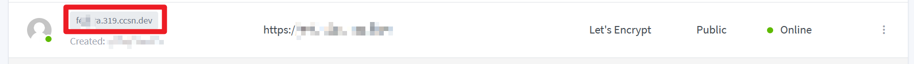
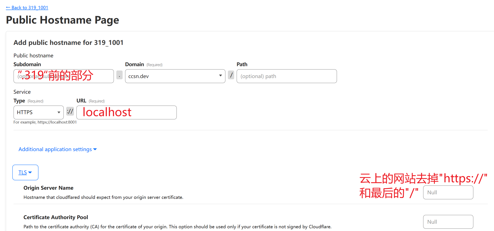
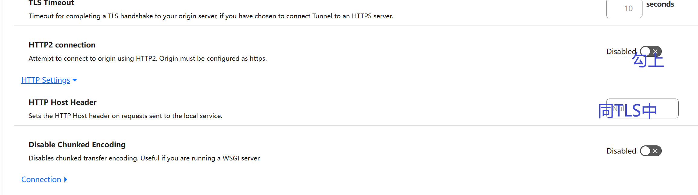

# 通过 Cloudfare Tunnels 添加本地已映射服务

## 登录cloudflare

1. 填入自己的邮箱，密码，点击“Log in”登录
   
   

2. 进入“Accounts”后点击“CCSN-BUCTSNC”。

3. 进入后在左边栏目中找到“Zero Trust”。

4. 进入“Zero Trust”后找到”Access“，在下拉栏目中点击"Tunnels"。

5. 进入“Tunnels”后找到319_1001，点击进入。(这是内网 nginx 所在的机器)

6. 在右边弹出的详情页点击”Configure“。

7. 进入“Configure”页面后点击“Public Hostname”，再点击“Add a public hostname"。

## 确定要转发什么上云

[Nginx Proxy Manager (ccsn.dev)](https://npm.319.ccsn.dev/) 里找得到对应的服务的话，找到相对应的内网的url并且复制保存好。如以下的 f**a.319.ccsn.dev，将其复制，保存。

随后确认没有被转发上云过——去掉.319部分，无法访问。

## 随后在 Cloudflare Dashboard 操作

1. 新建一个 public hostname 之后
- 在 Subdomain 中输入"319"前的部分， Domain选择ccsn.dev。

- sevice的 Type 选择 HTTPS ，URL输入"localhost"。

- TLS 中第一行输入云上的网站，去掉"https://"和最后的"/"。

- HTTP2 connection 选项勾上。

- HTTP Settings的网址与 TLS 中相同。

2. 保存

3. 在浏览器中访问，查看是否成功。

## 参考文档

[Via the dashboard · Cloudflare Zero Trust docs](https://developers.cloudflare.com/cloudflare-one/connections/connect-networks/install-and-setup/tunnel-guide/remote/)
