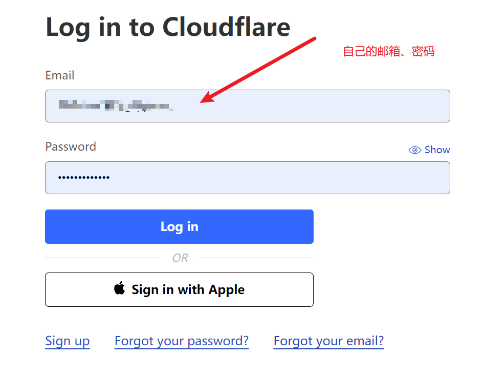
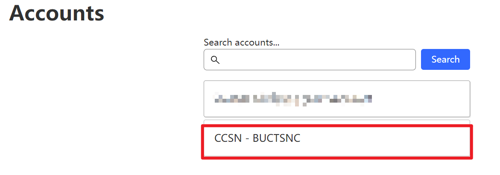
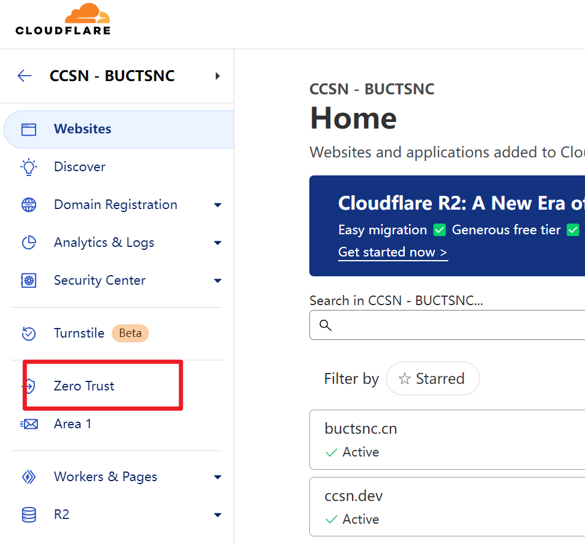
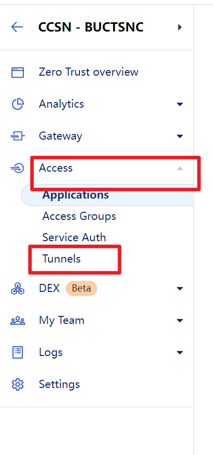
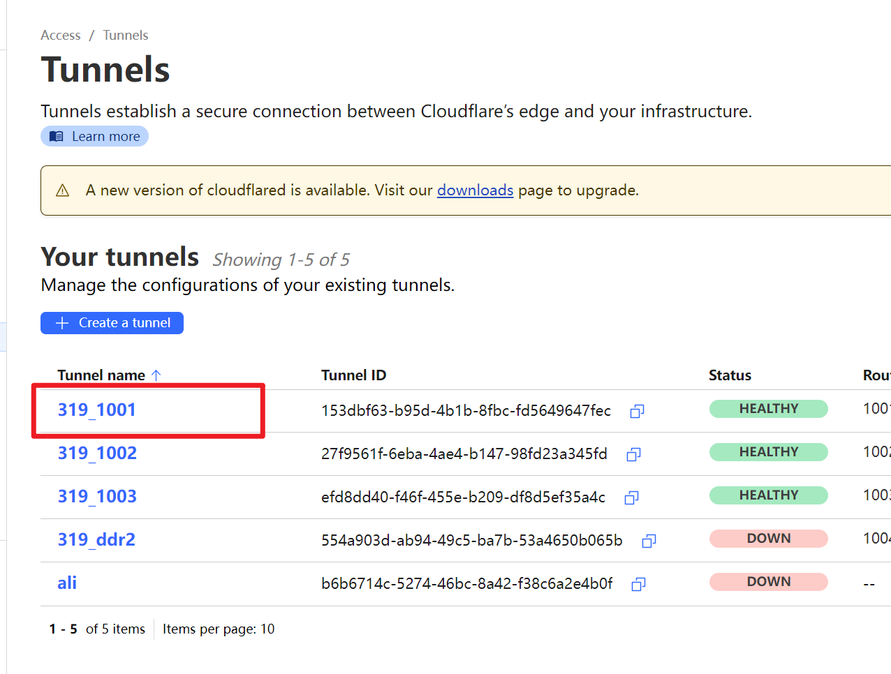
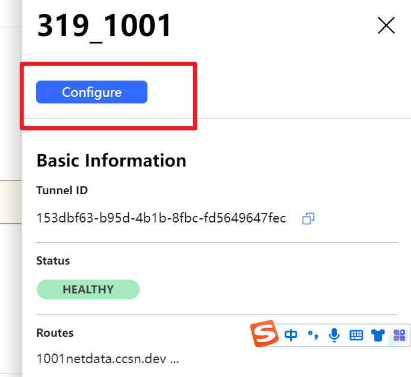
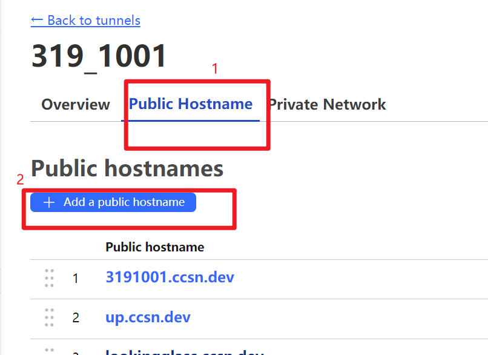

# 登录cloudflare

1. 填入自己的邮箱，密码，点击“Log in”登录
   
   

2. 进入“Accounts”后点击“CCSN-BUCTSNC”。

3. 进入后在左边栏目中找到“Zero Trust”。

4. 进入“Zero Trust”后找到”Access“，在下拉栏目中点击"Tunnels"。

5. 进入“Tunnels”后找到319_0001，点击进入。

6. 在右边弹出的详情页点击”Configure“。

7. 进入“Configure”页面后点击“Public Hostname”，再点击“Add a public hostname"。
