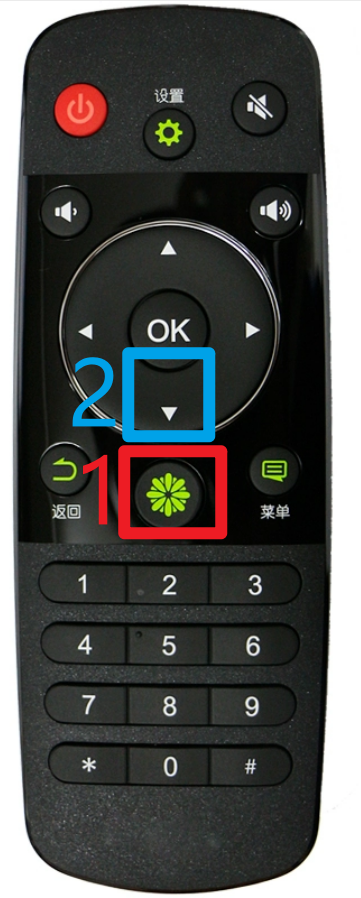

# spacedesk投屏电视

## 安装spacedesk

1. 下载spacedesk [下载地址](https://spacedesk.net/downloadidd64)

2. 安装，按提示操作即可

3. 打开该软件。注意不需要投屏时关闭，因为它没有密码保护，如何关闭可以参考下文的其他设置

4. 连接`SNC-backup`的wifi

## 如何连接

1. 电视开机，等待广告结束

2. 
   
   1. 进入电视系统
   
   2. 下滑进入电视系统中的软件
   
   3. 找到`spacedesk`,再按`ok`,进入

3. 选中对应的电脑，再按`ok`,即开始投屏

## 如何退出

1. 按返回键

2. 移动到`ok` ,再按遥控器上的`ok` 

3. 再按返回

## 其他设置

1. 按下`win+p`,参考[1] 进行配置
   
   投放ppt时推荐扩展

2. 如何关闭spacedesk的自启
   
   1. 在任务栏中找到该图标，右键
   
   2. 取消该项的勾选

## 参考资料

[1]: [Windows+P快捷键中出现的4个模式到底有什么区别](https://zhuanlan.zhihu.com/p/444864419)

[2]: Spacedesk官网 https://www.spacedesk.net/
